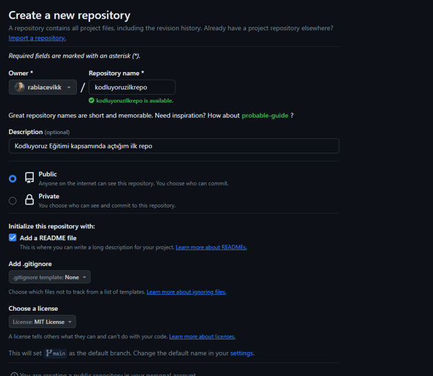

# kodluyoruzilkrepo
Kodluyoruz Eğitimi kapsamında açtığım ilk repo
-------------------------------------------------

-----------------------------
# **Installation**
Öncelikle projeyi clonelayın.(Buraya sizin reponuzdan aldığınız link gelecek)
```
git clone https://github.com/rabiacevikk/kodluyoruzilkrepo.git


```
# **Usage**

Projeyi cloneladıktan sonra Visual Studio Code programında açınız.

Linux için:

```
cd kodluyoruzilkrepo 

code .

```
# **Contributing**

Pull requestler kabul edilir. Büyük değişiklikler için, lütfen önce neyi degiştirmek
İstediğinizi tartışmak İçin bir konu açınız.

# **License**

[MIT](https://github.com/)
